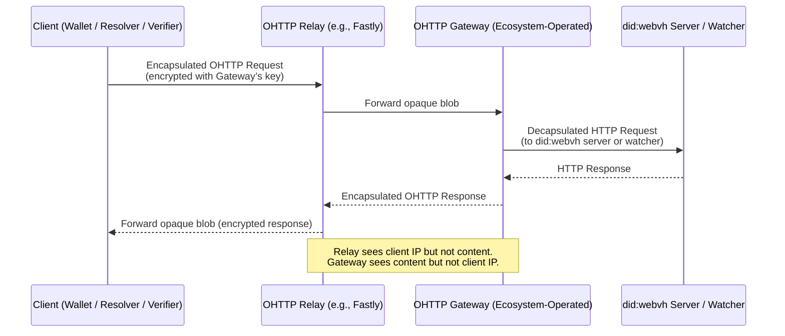

# did:webvh DID Method Work Item Rolling Agenda<!-- omit in toc -->

**Zoom Link**: [https://us02web.zoom.us/j/83119969275?pwd=IZTuXgGLtdLPjPLuB6q8zHXazxHSsU.1](https://us02web.zoom.us/j/83119969275?pwd=IZTuXgGLtdLPjPLuB6q8zHXazxHSsU.1)

**Agenda**: [did:webvh Info Site](https://didwebvh.info/latest/agenda/), [HackMD](https://hackmd.io/k4cIK9vQSlaeg2pdHE51IQ), [did:webvh Repository](https://github.com/decentralized-identity/didwebvh/blob/main/agenda.md) (synchronized after each meeting).

[**WG projects**](https://github.com/decentralized-identity?q=wg-cc&type=&language=) | [DIF page](https://identity.foundation/working-groups/claims-credentials.html) | [Mailing list and Wiki](https://lists.identity.foundation/g/cc-wg) | [Meeting recordings](https://docs.google.com/spreadsheets/d/1wgccmMvIImx30qVE9GhRKWWv3vmL2ZyUauuKx3IfRmA/edit?gid=111226877#gid=111226877)

## Table of Contents<!-- omit in toc -->

- [Meeting Information](#meeting-information)
- [Future Topics](#future-topics)
- [Meeting - 12 Feb 2026](#meeting---12-feb-2026)
- [Meeting - 29 Jan 2026](#meeting---29-jan-2026)
- [Meeting - 15 Jan 2026](#meeting---15-jan-2026)
- [Meeting - 18 Dec 2025](#meeting---18-dec-2025)
- [Meeting - 04 Dec 2025](#meeting---04-dec-2025)
- [Meeting - 20 Nov 2025](#meeting---20-nov-2025)
- [Meeting - 06 Nov 2025](#meeting---06-nov-2025)
- [Meeting - 23 Oct 2025](#meeting---23-oct-2025)
- [Meeting - 09 Oct 2025](#meeting---09-oct-2025)
- [Meeting - 25 Sept 2025](#meeting---25-sept-2025)
- [Meeting - 11 Sept 2025](#meeting---11-sept-2025)
- [Meeting - 28 Aug 2025](#meeting---28-aug-2025)
- [Meeting - 14 Aug 2025](#meeting---14-aug-2025)
- [Meeting - 31 Jul 2025](#meeting---31-jul-2025)
- [Meeting - 17 Jul 2025](#meeting---17-jul-2025)
- [Meeting - 03 Jul 2025](#meeting---03-jul-2025)
- [Prior Meetings](#prior-meetings)

## Meeting Information

- Before you contribute - **[join DIF]** and [sign the WG charter] (both are required!)
- Meeting Time: Every second Thursday at 9:00 Pacific (~=18:00 Central Europe)
- [Calendar entry]
- [ID WG participation tracking]
- [Zoom room]
- Links and Repositories:
    - [Specification], [Spec Repo], [Information Site]
    - Implementations: [TS], [Python], [Go], [Rust], [Server-Py]
    - Test Suite: [Test Suite]

_Participants are encouraged to turn your video on. This is a good way to build rapport across the contributor community._

_This document is live-edited DURING each call, and stable/authoritative copies live on our github repo under `/agenda.md`, link: [Agenda]._

[join DIF]: https://identity.foundation/join
[sign the WG charter]: https://bit.ly/DIF-WG-select1
[Calendar entry]: https://calendar.google.com/event?action=TEMPLATE&tmeid=NG5jYWowbmZsdWNzM21tYjBsbDIzdG50ZzFfMjAyNDA5MTJUMTYwMDAwWiBkZWNlbnRyYWxpemVkLmlkZW50aXR5QG0&tmsrc=decentralized.identity%40gmail.com&scp=ALL
[Zoom Room]: https://us02web.zoom.us/j/83119969275?pwd=IZTuXgGLtdLPjPLuB6q8zHXazxHSsU.1
[DIF Code of Conduct]: https://github.com/decentralized-identity/org/blob/master/code-of-conduct.md
[ID WG participation tracking]: https://docs.google.com/spreadsheets/d/12hFa574v5PRrKfzIKMgDTjxuU6lvtBhrmLspfKkN4oE/edit#gid=0
[operations@identity.foundation]: mailto:operations@identity.foundation
[did:webvh Specification license]: https://github.com/decentralized-identity/didwebvh/blob/main/LICENSE.md
[Agenda]: https://github.com/decentralized-identity/trustdidweb/blob/main/agenda.md
[Specification]: https://identity.foundation/didwevbvh
[Spec Repo]: https://github.com/decentralized-identity/didwebvh
[did:webvh AnonCreds Method]: https://identity.foundation/didwebvh/anoncreds-method/
[Information Site]: https://didwebvh.info
[Python]: https://github.com/decentralized-identity/didwebvh-py
[TS]: https://github.com/decentralized-identity/didwebvh-ts
[Go]: https://pkg.go.dev/github.com/nuts-foundation/trustdidweb-go
[Server-Py]: https://github.com/decentralized-identity/didwebvh-server-py
[Watcher-Py]: https://github.com/decentralized-identity/didwebvh-watcher-py
[Rust]: https://github.com/decentralized-identity/didwebvh-rs
[Affinidi Rust]: https://github.com/affinidi/affinidi-tdk-rs/tree/main/crates/affinidi-did-resolver/affinidi-did-resolver-methods/did-webvh
[Test Suite]: https://github.com/decentralized-identity/didwebvh-test-suite
[Implementations]: https://github.com/decentralized-identity/didwebvh-implementations
[did:webvh ACA-Py Plugin]: https://github.com/openwallet-foundation/acapy-plugins/tree/main/webvh
[Credo-TS]: https://github.com/openwallet-foundation/credo-ts
[did:webvh Static]: https://github.com/OpSecId/webvh-static
[did:webvh Tutorial]: https://didwebvh.info/latest/demos/understanding_didwebvh/
[DID Attested Resources]: https://identity.foundation/did-attested-resources
[DID Attested Resources Repository]: https://github.com/decentralized-identity/did-attested-resources

## Future Topics

- Using the `did:webvh` log format with other DID Methods
- Merging `did:webvh` features into `did:web`?

--------------------------------
## Meeting - 12 Feb 2026

Time: 9:00 Pacific / 17:00 Central Europe

Recording: [Zoom Recording and Chat Transcript](https://us02web.zoom.us/rec/share/U_6i6XBFCqohr1YYYq60-o2per4DDNV3VB6PY91TNq5z-v4dvlSKtt0TMtOev8QS._8PpWeuIb7R-RUoO)

### To Do's from this Meeting (as generated by Zoom):<!-- omit in toc -->

1. Stephen: Talk to Drummond about inlining witness proofs.
2. Patrick: Share the link to the domain transfer scenario Markdown document in the chat.
3. Stephen: Go through Patrick's scenario document and add more notes.
4. Stephen: Write out various options and scenarios for key revocation and accumulation of valid keys, and share with the group for discussion.
5. Group (implied Stephen/Patrick/Dmitri): In next version discussions, evaluate and document pros and cons of different approaches for handling key revocation and accumulation of valid keys in DIDWebVH, including responsibilities between resolver and client.
6. Group: Review DIDCore's handling of revoked keys and consider its applicability to DIDWebVH.

### Agenda and Notes<!-- omit in toc -->

1. Welcome and Adminstrivia
    1. Recording on?
    2. Please make sure you: [join DIF], [sign the WG Charter], and follow the [DIF Code of Conduct]. Questions? Please contact [operations@identity.foundation].
    3. [did:webvh Specification license] -- W3C Mode
    4. Introductions and requests for additional Agenda Topics

2. Announcements:

    - Stephen will be presenting at the W3C Credentials Community Group (CCG) Meeting this coming Tuesday, Feb. 17 at 9:00 Pacific / 18:00 Central Europe -- [Meeting Link](https://meet.google.com/dzc-yjfq-tyf)

3. Status updates on the implementations
    1. [TS] -- 
    2. [Credo-TS] -- 
    3. [Python] -- 
    4. [Rust] -- 
    5. [Server-Py] -- Seeing if DIF can be home
    6. [Watcher-Py] -- 
    7. [did:webvh AnonCreds Method] -- 
    8. [did:webvh ACA-Py Plugin] -- 
    9. [Test Suite] -- 
    10. [did:webvh Tutorial] -- 
    11. [Implementations] -- 

4. To Do's from Last Meeting:

    1. Stephen: Create a ticket/issue for the proposal to add heartbeat functionality and make the state attribute optional in the DIDWebVH spec.
    2. Stephen: Begin the process of letting the "next" version of the spec diverge from version 1, and lock version 1, by tracking new issues and changes in the "next" branch.
    3. DONE Patrick: Write up and share the use case explaining how the same domain could validly have two different skids, and both DIDs would be valid, for further discussion.
    4. DONE Stephen: Find the results of the performance test comparing inline witness proofs versus separate witness file to assess file size and caching impact.
    6. DONE Alexander: Update the example `did:scid:vh` DID in the notes with a resolvable DID, or send the correct example to Stephen if unable to update directly.

5. Discussion -- Optimizing Space Required For Inactive Keys

- Keys are added in DID Versions -- added to `state` -- for signing, encryption
- Keys are rotated -- current key becomes `inactive`
    - Need to convoy not used for signing (and when stopped), but OK for verification
- Keys are found to be compromised and are revoked
    - Need to convey that a key has been compromised and should NOT be used for verification
- Current approach -- DID Standard
    - Inactive keys remain in current DIDDocument
    - Revoked keys are removed from the current DIDDocument
- But...we have the full history -- why keep repeating the same key over and over
- Idea that keys are only put into the DID Log once
    - Revoked keys are revoked via a parameter -- probably needed regardless so metadata can be generated.
    - DIDDoc is compromised of current `state` PLUS an entry for each inactive key at the time of the version.
- Thoughts?
    - How is the `#<fragment>` for each key defined?
    - How are aliases for each key defined?
    - Too complicated?
    - Worth the savings?

6. [PRs](https://github.com/decentralized-identity/didwebvh/pulls) to review

7. [Issues](https://github.com/decentralized-identity/didwebvh/issues) to review

8. Open Discussion -- what else do you want to discuss?

## Meeting - 29 Jan 2026

Time: 9:00 Pacific / 17:00 Central Europe

Recording: [Zoom Recording and Chat Transcript](https://us02web.zoom.us/rec/share/wuvBinWj9dB-WzwnOFPFJtWyLFnJSG32kuqwmsQQBz3SRUuWHU--nliPQ5PjjfBp.yWaGJLNgywxDg2xF)

### To Do's from this Meeting (as generated by Zoom):<!-- omit in toc -->

1. Stephen: Create a ticket/issue for the proposal to add heartbeat functionality and make the state attribute optional in the DIDWebVH spec.
2. Stephen: Begin the process of letting the "next" version of the spec diverge from version 1, and lock version 1, by tracking new issues and changes in the "next" branch.
3. Patrick: Write up and share the use case explaining how the same domain could validly have two different skids, and both DIDs would be valid, for further discussion.
4. Stephen: Find the results of the performance test comparing inline witness proofs versus separate witness file to assess file size and caching impact.
6. Alexander: Update the example `did:scid:vh` DID in the notes with a resolvable DID, or send the correct example to Stephen if unable to update directly.

### Agenda and Notes<!-- omit in toc -->

1. Welcome and Adminstrivia
    1. Recording on?
    2. Please make sure you: [join DIF], [sign the WG Charter], and follow the [DIF Code of Conduct]. Questions? Please contact [operations@identity.foundation].
    3. [did:webvh Specification license] -- W3C Mode
    4. Introductions and requests for additional Agenda Topics

2. Announcements:

    - Traction Sandbox BCVH instance now live. [Initial workshop](https://aca-py.org/latest/demo/WebVH-Workshop/)

3. Status updates on the implementations
    1. [TS] -- 
    2. [Credo-TS] -- 
    3. [Python] -- 
    4. [Rust] -- 
    5. [Server-Py] -- New location for charts
    6. [Watcher-Py] -- Consolidate into server? "watcher" mode, one codebase, leverage same UI/Explorer
    7. [did:webvh AnonCreds Method] -- 
    8. [did:webvh ACA-Py Plugin] -- Added controller request store
    9. [Test Suite] -- 
    10. [did:webvh Tutorial] -- Acapy/Traction workshop
    11. [Implementations] -- 

4. To Do's from Last Meeting:

    1. Setup a demo time with Thijme.

5. Thijme -- Demo of work.

6. Continuing the did:webvh and did:cel Discussion

- For v2, we need to at least change the implict services defined by did:webvh. What else?
- Heartbeats -- easy -- parameter. Should we also make the `state` optional to optimize space efficiency when using mostly heartbeats. If missing, the previous `state` value still applies. Other than that -- each heartbeat is just a version.
- Witnesses -- issues -- separate, culled file vs. inline. Let's revisit that...
    - Recall the performance test that Glenn Gore did -- [details are here](https://didwebvh.info/latest/faq/WitnessFile/)
        - Total (Log + Witness) size is doubled, retrieval takes longer, processing takes longer.
- Making the domain part of the DID optional.
    - Patrick has ideas to share!
    - Detach the DID from the Domain -- same rules as portability.
        - Also allows attaching the DID to a new domain.
    - Moves did:webvh to align with did:scid
        - Demostration: use did:scid -- no location and published on Hedera
        - Example DID that use the did:webvh Log and storage is on Hedera: `did:scid:vh:1:QmfGEUAcMpzo25kF2Rhn8L5FAXysfGnkzjwdKoNPi615XQ?src=hedera:testnet:0.0.1001`
- The log format -- any changes?
    - Consolidating witness proofs and log, would help with `location-less` dids.
- What are the optional things the did:cel crowd might not like?
    - List of things that are optional in `did:webvh`:
        - Domain component (if we decide to make it optional).
        - DID Portability (changing domain component, keeping SCID and history).
            - Challenging when DIDs can move and then a new one created with the same domain.
            - Two SCIDs and one ported, the other remaining.
            - To confirm: a ported DID has the alsoKnownAs with the old DID.
        - DID Spec Version (allows changing cryptographic algorithms mid-log).
        - Prerotation
            - Was this part of the list?
        - Witnesses
            - Oblivious witnessing
        - Watchers
            - Where they are (comparable to the did:cel data element)
            - The Watchers API -- webhooks, reads, removals
        - Mechanical translation from did:webvh to did:web
        - TTL

7. [PRs](https://github.com/decentralized-identity/didwebvh/pulls) to review

8. [Issues](https://github.com/decentralized-identity/didwebvh/issues) to review

9. Open Discussion -- what else do you want to discuss?

## Meeting - 15 Jan 2026

Time: 9:00 Pacific / 17:00 Central Europe

Recording: [Zoom Recording and Chat Transcript](https://us02web.zoom.us/rec/share/OSbFr-fIVAhQjRlmd8Svq1JkWLsTQNXCqzoed3exwNY8TytsE4c5_Ukd4w_6gbhM.LhuIwAuVLFe4lMoP)

### To Do's from this Meeting (as generated by Zoom):<!-- omit in toc -->

1. Setup a demo time with Thijme.

### Agenda and Notes<!-- omit in toc -->

1. Welcome and Adminstrivia
    1. Recording on?
    2. Please make sure you: [join DIF], [sign the WG Charter], and follow the [DIF Code of Conduct]. Questions? Please contact [operations@identity.foundation].
    3. [did:webvh Specification license] -- W3C Mode
    4. Introductions and requests for additional Agenda Topics

2. Announcements:

    - [Danube Tech]() has added did:webvh support to their [GoDiddy](https://godiddy.com/) service, with some interesting key management approaches, allowing private keys to be stored in a hosted wallet service (at Godiddy), or stored on the client side, or stored in an external KMS system such as Hashicorp Vault.
    - Thijme -- student in Business Admin and Tech -- doing a project on did:webvh -- using a did:webvh to twin with product. Demo to show at a future meeting.

3. Status updates on the implementations
    1. [TS] -- 
    2. [Credo-TS] -- 
    3. [Python] -- 
    4. [Rust] -- 
    5. [Server-Py] -- 
    6. [Watcher-Py] -- 
    7. [did:webvh AnonCreds Method] -- 
    8. [did:webvh ACA-Py Plugin] -- 
    9. [Test Suite] -- 
    10. [did:webvh Tutorial] -- 
    11. [Implementations] -- 

4. To Do's from Last Meeting:

- Nothing relevant to cover here.

5. did:webvh and did:cel Discussion

- Manu Sporny: A briefing on [did:cel](https://digitalbazaar.github.io/did-cel-spec/) -- key features, design goals. [Slides](https://docs.google.com/presentation/d/1MlldyytklkYoPwPP47SuFZNsfNMeEFTM2fnmaEIYiD4/edit?slide=id.p#slide=id.p)
- did:cel features in did:webvh
    - heartbeat -- 2 parts: commitment to timely updates, optimizing log size
        - Add an element to the `parameters` object: `"heartbeat": "P30D"` -- uses the [ISO 8601 Duration Format](https://docs.digi.com/resources/documentation/digidocs/90001488-13/reference/r_iso_8601_duration_format.htm), any DID that has versions with versionTime longer than the "heartbeat" commitment, or where the last `versionTime` is more `heartbeat` from `now()` fails verification.
        - Consider optimizing the log size where there is a high expectation that there will be many more heartbeat entries than updates. In that case, the only optimization I would suggest is make `state` optional, and when left out, the previous value remains in effect. The rest of the log entries are necessary, so keeping them is necessary.
    - oblivious witnesses -- no change to functionality, just a change to first three steps of the process of [Witnessing a DID Version Update](https://identity.foundation/didwebvh/v1.0/#witnessing-a-did-version-update) to remove the requirement that a witness verify a DID before witnessing it. A witness need only receive the `versionId` of the new version, "approve" it (ecosystem dependent governance) and return a proof.
    - A SCID-only did:webvh DID -- our ongoing discussion.
        - As previously noted, a relatively small change to the specification -- changing the wording from "here is where you get the log" to "you must get the log via one of these ways" and including the URL component of the DID, the query parameter, a watcher or "you just know".
        - Use cases?
- The Desirability (or not) of Optional Features in did:webvh
    - List:
        - Domain component (if we decide to make it optional).
        - DID Portability (changing domain component, keeping SCID and history).
        - DID Spec Version (allows changing cryptographic algorithms mid-log).
        - Prerotation
        - Witnesses
        - Watchers
            - Where they are (comparable to the did:cel data element)
            - The Watchers API -- webhooks, reads, removals
        - Mechanical translation from did:webvh to did:web
        - TTL
    - Differences:
        - The log format
        - Separate keys -- log vs. DID
        - 

5. [PRs](https://github.com/decentralized-identity/didwebvh/pulls) to review

6. [Issues](https://github.com/decentralized-identity/didwebvh/issues) to review

7. Open Discussion -- what else do you want to discuss?

## Meeting - 18 Dec 2025

Time: 9:00 Pacific / 17:00 Central Europe

Recording: [Zoom Recording and Chat Transcript](https://us02web.zoom.us/rec/share/vU8MQloh9kHdvwo04EsMwyL6yPLcmc2JqDGC_XobFo8tTPSK9xtPYLhjajU5YCSU.o3eRhDa5C67oRJ9v)

### To Do's from this Meeting (as generated by Zoom):<!-- omit in toc -->

1. Stephen: Add links to the spec and the series of messages from the CCG/W3CCG mailing list to the agenda or relevant documentation.
2. All: Continue discussion in chat regarding the application of did:cel traits to did:webvh and related implementation questions.
3. All: Have a great end of 2025 -- and a wonderful 2026.

### Agenda and Notes<!-- omit in toc -->

1. Welcome and Adminstrivia
    1. Recording on?
    2. Please make sure you: [join DIF], [sign the WG Charter], and follow the [DIF Code of Conduct]. Questions? Please contact [operations@identity.foundation].
    3. [did:webvh Specification license] -- W3C Mode
    4. Introductions and requests for additional Agenda Topics

2. Announcements:
    1. Hard stop today at 9:25 Pacific -- I have another meeting...
    2. did:cel announcement, spec and discussion.
    3. No meeting on Dec. 30, 2025.  Happy New Year! See you in 2026!

3. Status updates on the implementations
    1. [TS] -- 
    2. [Credo-TS] -- 
    3. [Python] -- 
    4. [Rust] -- 
    5. [Server-Py] -- higher level usage -- UI and client APIs
    6. [Watcher-Py] -- 
    7. [did:webvh AnonCreds Method] -- 
    8. [did:webvh ACA-Py Plugin] -- 
    9. [Test Suite] -- 
    10. [did:webvh Tutorial] -- 
    11. [Implementations] -- 

4. To Do's from Last Meeting:

    1. DONE Stephen: ping Steve Capell to see where DIA is and see whether it can be used
    2. Stephen: follow up on a couple of issues that are in the issues list
    3. DONE Stephen: have a session with Drummond next week in Victoria talking about location-independent DIDs


5. [PRs](https://github.com/decentralized-identity/didwebvh/pulls) to review

6. [Issues](https://github.com/decentralized-identity/didwebvh/issues) to review

7. Add did:cel features to did:webvh
   - Oblivious witness -- it's what we do, just need to remove that witness must see/verify the DID Log Entry before witnessing (unless it needs to).
   - Heartbeat -- Easy to add a "`heartbeat: <time>`" parameter, that commits the DID Controller and define what it means to a DID Resolver if that commit is missed (DID is deactivated per did:cel).
       - A heartbeat requires a log entry within a given period of time, and if not provided the DID is deactivated. Says nothing about what that log entry should be -- just must be an entry.
       - Separate topic -- should we allow an update WITHOUT a "`state`" value that implies "no change". If using pre-rotation? Other issues?  Other things to minimize space.
   - The discussion we had last week -- a did:webvh with no domain/path component -- just `did:webvh:<scid>`.

8. Open Discussion -- what else do you want to discuss?

## Meeting - 04 Dec 2025

Time: 9:00 Pacific / 17:00 Central Europe

Recording: [Zoom Recording and Chat Transcript](https://us02web.zoom.us/rec/share/MKxfwNPtwbGDMm995m71-m_Jv9VTaITKhLAECo13q1KVJ-E-GgIvWJPW0fPwjD7U.4ZdpkDvEn13wdJHp)

### To Do's from this Meeting (as generated by Zoom):<!-- omit in toc -->

1. Stephen: ping Steve Capell to see where DIA is and see whether it can be used
2. Stephen: follow up on a couple of issues that are in the issues list
3. Stephen: have a session with Drummond next week in Victoria talking about location-independent DIDs


### Agenda and Notes<!-- omit in toc -->

1. Welcome and Adminstrivia
    1. Recording on?
    2. Please make sure you: [join DIF], [sign the WG Charter], and follow the [DIF Code of Conduct]. Questions? Please contact [operations@identity.foundation].
    3. [did:webvh Specification license] -- W3C Mode
    4. Introductions and requests for additional Agenda Topics

2. Announcements:
    1. Demo of issuing/verifying did:webvh-rooted AnonCreds credentials using ACA-Py/Traction (issuer/verifier) and Credo-TS/Bifold Wallet in the public BC Wallet. w00t!! Lots of did:webvh Server upgrades to enable that, plus the creation of a Public Testing did:webvh server instance.

3. Status updates on the implementations
    1. [TS] -- 
    2. [Credo-TS] -- 
    3. [Python] -- 
    4. [Rust] -- 
    5. [Server-Py] -- Lots of updates
    6. [Watcher-Py] -- 
    7. [did:webvh AnonCreds Method] -- 
    8. [did:webvh ACA-Py Plugin] -- Lots of updates
    9. [Test Suite] -- 
    10. [did:webvh Tutorial] -- 
    11. [Implementations] -- 

4. To Do's from Last Meeting:

    1. DONE Stephen: Get the agenda PRs in
    2. Stephen: Take a look at the issue about including prior DIDs in `alsoKnownAs` of the DIDDoc and draft a PR on that one

5. [PRs](https://github.com/decentralized-identity/didwebvh/pulls) to review

6. [Issues](https://github.com/decentralized-identity/didwebvh/issues) to review

7. Is the did:webvh server trusted?
    - As trusted as the governance behind it?
    - Example: BC Gov has 4 instances:
        - Sandbox -- anyone can use it, reset 1st & 15th of the month.
        - Dev, Test, Prod -- published governance on who can publish to it. Could be trusted.
    - But can we make that visible and discoverable, with defined "Levels of Assurance" -- allowing for machine-readability?
    - With current implementation -- access the did:webvh server, with its configuration (list of witnesses, etc.) and a did:web.
        - How do you convey the server's did:webvh for determining trust given you only have the DID of the Issuer that is published on the server.
            - did:webvh server issues a credential to the DID. Contains the did:webvh DID, which can then be resolved, and its /whois checked.
            - Use the delegation possibility in DID Core to have the admin of the server manage its did:webvh server -- and issue credentials.

8. Topic: Should we add a location-less did:webvh to the specification? DID is just `did:webvh:<scid>`. The client resolving the DID must know how to resolve the DID, based on "context":

   - Benefits:
     - Could publish the identifier with a did:scid-like query parameter "`?src=<URL>`" that holds the location.
       - Should that just be the server location, or should it include "did.jsonl"?
         - Depends entirely on what the location is -- cheqd, HTTP, etc.
       - Any special ".well-known" handling needed?
     - Could be did:peer like and client finds DID Log in local storage.
     - Could be did:plc-like and everyone in an ecosystem "knows" where to get the DID Log location via an API lookup. A Watcher can be used for that -- although how that Watcher gets updates is TBD.
     - Others?
     - Value?
   - Argument against -- interop is harder. Loss of did:web simplicity.
   - Allows for other "DID methods" to use this log format and just adds how to find the DID Log -- on your favourite blockchain.

9. Open Discussion -- what else do you want to discuss?

## Meeting - 20 Nov 2025

Time: 9:00 Pacific / 17:00 Central Europe

Recording: Zoom Recording and Chat Transcript -- No Recording, as there were no topics to discuss.

### To Do's from this Meeting (as generated by Zoom):<!-- omit in toc -->

No To Do's created.

### Agenda and Notes<!-- omit in toc -->

1. Welcome and Adminstrivia
    1. Recording on?
    2. Please make sure you: [join DIF], [sign the WG Charter], and follow the [DIF Code of Conduct]. Questions? Please contact [operations@identity.foundation].
    3. [did:webvh Specification license] -- W3C Mode
    4. Introductions and requests for additional Agenda Topics

2. Announcements:
    1. 

3. Status updates on the implementations
    1. [TS] -- 
    2. [Credo-TS] -- 
    3. [Python] -- 
    4. [Rust] -- 
    5. [Server-Py] -- 
    6. [Watcher-Py] -- 
    7. [did:webvh AnonCreds Method] -- 
    8. [did:webvh ACA-Py Plugin] -- 
    9. [Test Suite] -- 
    10. [did:webvh Tutorial] -- 
    11. [Implementations] -- 

4. To Do's from Last Meeting:

    1. Stephen: Follow up on the issues that were not addressed from the last meeting
    2. DONE Stephen: Get the agenda PRs in
    3. Stephen: Take a look at the issue about including prior DIDs in `alsoKnownAs` of the DIDDoc and draft a PR on that one

5. [PRs](https://github.com/decentralized-identity/didwebvh/pulls) to review

6. [Issues](https://github.com/decentralized-identity/didwebvh/issues) to review

7. Open Discussion -- what else do you want to discuss?

## Meeting - 06 Nov 2025

Time: 9:00 Pacific / 17:00 Central Europe

Recording: [Zoom Recording and Chat Transcript](https://us02web.zoom.us/rec/share/2oHS1ZBGbI83XqrxmNRHaEnAM6Np4WXwhtH_ZnaUA7nAVnxh-gtO-N-bmXYxnqgI.5kzcAbd9s4wmiXJD)

### To Do's from this Meeting (as generated by Zoom):<!-- omit in toc -->

1. Stephen: Follow up on the issues that were not addressed from the last meeting
2. Stephen: Get the agenda PRs in
3. Stephen: Take a look at the issue about including prior values  and draft a PR on that one
4. Stephen and Patrick: Iterate on the "must" vs "should" requirement for prior values and have the discussion on the PR

### Agenda and Notes<!-- omit in toc -->

1. Welcome and Adminstrivia
    1. Recording on?
    2. Please make sure you: [join DIF], [sign the WG Charter], and follow the [DIF Code of Conduct]. Questions? Please contact [operations@identity.foundation].
    3. [did:webvh Specification license] -- W3C Mode
    4. Introductions and requests for additional Agenda Topics

2. Announcements:
    1. 

3. Status updates on the implementations
    1. [TS] -- 
    2. [Credo-TS] -- 
    3. [Python] -- 
    4. [Rust] -- 
    5. [Server-Py] -- Great progress - demonstrated during the call.
    6. [Watcher-Py] -- 
    7. [did:webvh AnonCreds Method] -- 
    8. [did:webvh ACA-Py Plugin] -- 
    9. [Test Suite] -- 
    10. [did:webvh Tutorial] -- 
    11. [Implementations] -- 

4. To Do's from Last Meeting:

    1. NOT POSSIBLE -- draft only -- not public yet - Stephen to add the link to the Government of Canada document about digital trust guidance that includes DIDWebVH.
    2. NOT DONE - Stephen to respond to Vasily's issue from Switzerland regarding the implementer's Guide and consistency with the spec.
    3. NOT DONE - Stephen to prepare for discussion about changes to the DIDWebVH spec due to changes in the core spec/DID resolution spec for the next meeting.
    4. NOT DONE - Stephen to share the VLEI DidWeb tests/Jupyter Notebook with Patrick.
    5. NOT DONE - Stephen and Patrick to brainstorm and develop educational tools similar to the Jupyter Notebook for DIDWebVH.
    6. DONE - Patrick to continue work on getting the Credo TS implementation into the BC Wallet to handle DIDWebVH DIDs.

5. [PRs](https://github.com/decentralized-identity/didwebvh/pulls) to review

6. [Issues](https://github.com/decentralized-identity/didwebvh/issues) to review

7. Patrick St. Louis and progress on the did:webvh server.
    1. Demo and discussion

8. Impact of new DID Path processing rules on did:webvh.

9. Open Discussion -- what else do you want to discuss?

## Meeting - 23 Oct 2025

Time: 9:00 Pacific / 17:00 Central Europe

Recording: [Zoom Recording and Chat Transcript](https://us02web.zoom.us/rec/share/9MiOWQV0-TDD5aJn3SkZ1jZ0cCwRIg7XfKYzte6aqq-DZ6jnFX1vTXJOf1Z4fuCU.O5DsvN-eX_Pt1Tv1)

### To Do's from this Meeting (as generated by Zoom):<!-- omit in toc -->

1. Stephen to add the link to the Government of Canada document about digital trust guidance that includes DIDWebVH.
2. Stephen to respond to Vasily's issue from Switzerland regarding the implementer's Guide and consistency with the spec.
3. Stephen to prepare for discussion about changes to the DIDWebVH spec due to changes in the core spec/DID resolution spec for the next meeting.
4. Stephen to share the VLEI DidWeb tests/Jupyter Notebook with Patrick.
5. Stephen and Patrick to brainstorm and develop educational tools similar to the Jupyter Notebook for DIDWebVH.
6. Stephen to tag meeting participants in the notes so they can check the latest implementation status updates.
7. Patrick to continue work on getting the Credo TS implementation into the BC Wallet to handle DIDWebVH DIDs.

### Attendees:<!-- omit in toc -->

- Stephen Curran
- Makki
- Carly
- Ivan

### Agenda and Notes<!-- omit in toc -->

1. Welcome and Adminstrivia
    1. Recording on?
    2. Please make sure you: [join DIF], [sign the WG Charter], and follow the [DIF Code of Conduct]. Questions? Please contact [operations@identity.foundation].
    3. [did:webvh Specification license] -- W3C Mode
    4. Introductions and requests for additional Agenda Topics

2. Announcements:
    1. Government of Canada includes did:webvh in their Digital Trust guidance.
    2. DID Working Group adjusting DID URL path resolution handling

3. Status updates on the implementations
    1. [TS] -- 
    2. [Credo-TS] -- 
    3. [Python] -- 
    4. [Rust] -- 
    5. [Server-Py] -- Awesome progress on the UI and performance.
    6. [Watcher-Py] -- 
    7. [did:webvh AnonCreds Method] -- 
    8. [did:webvh ACA-Py Plugin] -- 
    9. [Test Suite] -- 
    10. [did:webvh Tutorial] -- 
    11. [Implementations] -- 

4. To Do's from Last Meeting:

    1. DONE Stephen to write up the proposal for path handling in DID Resolution spec based on the discussion.
    2. DONE Stephen to reach out to other stakeholders about the path handling proposal before creating a PR.
    3. DONE Stephen to create a PR for the DID Resolution spec to include the path handling proposal.
    4. TO DO Stephen to put a note on LinkedIn about did:webvh becoming officially DIF-recommended.
    5. DONE Brian to follow up with Patrick about the schema name, version, and cred def tag exposure in Credo, Bifold Wallet, and BC wallet.


5. [PRs](https://github.com/decentralized-identity/didwebvh/pulls) to review

6. [Issues](https://github.com/decentralized-identity/didwebvh/issues) to review

7. Open Discussion -- what else do you want to discuss?

## Meeting - 09 Oct 2025

Time: 9:00 Pacific / 17:00 Central Europe

Recording: [Zoom Recording and Chat Transcript](https://us02web.zoom.us/rec/share/wjgxiIcsQSEvxlGD-DhJbY3N-J4xxCMcR0eLJwTyINqt66iatrjOUWRmKafB2IFT.637lSjKcNfJZQWRS)

### To Do's from this Meeting (as generated by Zoom):<!-- omit in toc -->

1. Stephen to write up the proposal for path handling in DID Resolution spec based on the discussion.
2. Stephen to reach out to other stakeholders about the path handling proposal before creating a PR.
3. Stephen to create a PR for the DID Resolution spec to include the path handling proposal.
4. Stephen to put a note on LinkedIn about did:webvh becoming officially DID recommended.
5. Brian to follow up with Patrick about the schema name, version, and cred def tag exposure in Credo, Bifold Wallet, and BC wallet.

### Attendees:<!-- omit in toc -->

- Stephen Curran
- Brian Richter
- Dmitri Zagidulin
- Patrick St. Louis


### Agenda and Notes<!-- omit in toc -->

1. Welcome and Adminstrivia
    1. Recording on?
    2. Please make sure you: [join DIF], [sign the WG Charter], and follow the [DIF Code of Conduct]. Questions? Please contact [operations@identity.foundation].
    3. [did:webvh Specification license] -- W3C Mode
    4. Introductions and requests for additional Agenda Topics

2. Announcements:
    1. The DID Methods Standardization Working Group has made did:webvh a "DIF Recommended" [via this PR](https://github.com/decentralized-identity/did-methods/pull/67). Comments and objections were collected for 60 days, through September 28, 2025 and no objections were received.
    2. ACA-Py User Group meeting this Tuesday will cover the publication of did:webvh DIDs and AnonCreds resources from ACA-Py with Endorsement. Link to agenda to be added.

3. Status updates on the implementations
    1. [TS] -- 
    2. [Credo-TS] -- PR in Bifold to handle AnonCreds Schema/CredDef names. Might need more work.
    3. [Python] -- 
    4. [Rust] -- 
    5. [Server-Py] -- Explorer sped up -- database of DIDs and resources created.
    6. [Watcher-Py] -- 
    7. [did:webvh AnonCreds Method] -- 
    8. [did:webvh ACA-Py Plugin] -- 
    9. [Test Suite] -- 
    10. [did:webvh Tutorial] -- 
    11. [Implementations] -- 

4. To Do's from Last Meeting:

    1. DONE - Patrick to optimize the storage and performance of the DidWebVH Explorer.
    2. Patrick to implement a function in did-webvh-python that prunes witness files based on logs.
    3. DONE - Brian to investigate caching schema names in the wallet to improve credential display performance.
    4. DONE - Brian to continue working on the AnonCreds resources for Credo registration.
    5. DONE - Stephen to close the benchmark issue related to did-webvh.
    6. Team to update an OCA bundle to include the identifier once the sandbox is up.
    7. DONE (Issue added) - Team to explore implementing Oblivious HTTP in did-webvh resolvers.

5. No [PRs](https://github.com/decentralized-identity/didwebvh/pulls) to review

6. No new [Issues](https://github.com/decentralized-identity/didwebvh/issues) to review

7. DID URL Path Resolution -- want to talk about it? Yes!
    - Fragments -- handle the same as HTTP -- client deals with the resolved resource and content type.
    - Path -- `<did>/path/to/resource`
      - left to each DID method
      - Goal: Path resolved through a storage system mechanism
      - High level approach -- look in the services section -- under the appropriate types use that as the base.
      - Cascading fallback algo:
          - Use Cases:
              - One storage service -- one path `<serviceEndpoint>/path/to/file`
          - What if there are multiple?
              - Current -- use a query parameter to point to a specific service. `service='<id?'`
              - Could we use a `prefix` notation? Use the path to determine the right service, and the type of the service to define the serviceEndpoint handling.
                  - `prefix`: '<did>/googledrive/path/to/file'
                  - `prefix`: '/dropbox/'
          - The `whois` use case doesn't work with the above.  Instead, what about a query parameter `/whois`?
              - Could we use the matches on prefix and service type?
    
**Redirection Algorithm for DID URL Paths**

Given a DID URL of the form <did>/path/to/file, perform the following steps to resolve it to a target resource via service redirection:

1.  **Extract the Path** 
    
    Extract the _path_ component from the DID URL (e.g., /path/to/file).
    
2.  **Identify Matching Services** 
    
    From the DID Document, find all services that include a prefix property. For each such service:
    
    -   Check if the DID URL path starts with the service’s prefix value.
    -   Keep all services where this is true.

3.  **Select the Best Match** 
    
    From the matching services:
    
    -   Select the service with the **longest matching prefix** (i.e., the most specific match).        
    
4.  **Construct the Redirect URL** 
    
    -   Remove the matching prefix from the start of the DID URL path.
        
    -   Append the remainder to the serviceEndpoint of the selected service, ensuring appropriate URL concatenation.
    
    - Question: Should we allow for service `type` specific processing in assembling/resolving the `serviceEndpoint`.
        
    
5.  **Resolve the Target** 
    
    -   Resolve the resulting URL.
        
    -   Return the resolved resource and associated metadata.
        

---

**Notes:**

-   Matching is literal, case-sensitive, and must be prefix-based (e.g., /docs matches /docs/file.txt but not /documents/file.txt).
    
-   If no service matches, the DID URL is not redirected and may resolve to the DID Document or be treated as an error.
    
-   This algorithm assumes the serviceEndpoint is an HTTP(S) URL or another resolvable resource reference.

```json
services: [
  { 
      id: '...',
      type: 'FileService',
      prefix: '/',
      serviceEndpoint: 'https://my.storage.example/files/'
   }
]

```

For `<did>/whois`, the prefix matches the entire path, so an empty string is appended to the serviceEndpoint, so the serviceEndpoint is the full URL of the verifiable presentation.

```json
services: [
  {
     id: 'my-whois-service',
     prefix: '/whois',
     type: 'WhoisService',
     serviceEndpoint: 'https://server/path/to/whois.vp'
  }
]
```

8. Open Discussion -- what else do you want to discuss?

## Meeting - 25 Sept 2025

Time: 9:00 Pacific / 17:00 Central Europe

Recording: [Zoom Recording and Chat Transcript](https://us02web.zoom.us/rec/share/YmpNL8SOoWZxsrkLDVAnYercy-jIOJ9eiukQrFUsbTnTXvcF17EqxJqe7sTa5Iex.IyJaNLb1tqTCQlwr)

### To Do's from this Meeting (as generated by Zoom):<!-- omit in toc -->

1. Patrick to optimize the storage and performance of the DidWebVH Explorer.
2. Patrick to implement a function in did-webvh-python that prunes witness files based on logs.
3. Brian to investigate caching schema names in the wallet to improve credential display performance.
4. Brian to continue working on the Anon Creds resources for Credo registration.
5. Stephen to close the benchmark issue related to did-webvh.
6. Team to update an OCA bundle to include the identifier once the sandbox is up.
7. Team to explore implementing Oblivious HTTP in did-webvh resolvers.

### Attendees:<!-- omit in toc -->

- Stephen Curran
- Brian Richter
- Dmitri Zagidulin
- Alexander Shenshin
- Patrick St. Louis

### Agenda and Notes<!-- omit in toc -->

1. Welcome and Adminstrivia
    1. Recording on?
    2. Please make sure you: [join DIF], [sign the WG Charter], and follow the [DIF Code of Conduct]. Questions? Please contact [operations@identity.foundation].
    3. [did:webvh Specification license] -- W3C Mode
    4. Introductions and requests for additional Agenda Topics

2. Announcements:
    1. Presentation about did:webvh and [DID Attested Resources] planned for September 15, 2025 at the OpenWallet Foundation's Wallet Interoperability SIG. Meeting Agenda and Zoom Link [here](https://lf-openwallet-foundation.atlassian.net/wiki/spaces/GROUP/pages/221970474/2025-09-15+Wallet+Interop+SIG). [Recording](https://zoom.us/rec/share/odK9dUKf8wVNKpDiHFvJ_vqHXYwKLszrUxagccibLIN7xwWOhXTFjTqQhgU_QPJF.wlVcop5Kx6DSSmeZ), [Slides](https://docs.google.com/presentation/d/14bgzrU-o035LBnejNm-wHq863ZFXINe4MUokfm4G0vM/edit?slide=id.p#slide=id.p).
    2. NEW! -- did:webvh Explorer added to the did:webvh [Server-Py]! Checkout [https://demo.identifier.me/explorer](https://demo.identifier.me/explorer) as an example. Awesome work by @PatStLouis!
    3. Update to [Rust] implementation -- 0.1.6. New dependencies to improve integration, updates to the Wizard (e.g. automated did:web generation), more automated tests (74.27% coverage) and more!
    4. Reminder: The DID Methods Standardization Working Group [PR to make did:webvh "DIF Recommended"](https://github.com/decentralized-identity/did-methods/pull/67) has been published. Comments and objections will be collected for 60 days, through September 28, 2025. Please keep an eye on the PR.

3. Status updates on the implementations
    1. [TS] -- demo of [did:webvh-rooted AnonCreds VCs used in BC Wallet](https://www.youtube.com/watch?v=8MBxhJ-7XR4). Yay!!!
    2. [Credo-TS] -- Support for did:webvh AnonCreds registration being implemented via [this PR](https://github.com/openwallet-foundation/credo-ts/pull/2396) for the main banch and [this PR](https://github.com/openwallet-foundation/credo-ts/pull/2419) for the 0.5.x branch.
    3. [Python] -- to do -- adding a function to prune the witness file given a DID Log and set of witness proofs.
    4. [Rust] -- 
    5. [Server-Py] -- 
    6. [Watcher-Py] -- 
    7. [did:webvh AnonCreds Method] -- 
    8. [did:webvh ACA-Py Plugin] -- PR streamlines the DID operations for update and deactivation. Enables use of DID for the DIDComm channel -- copying from the Cheqd implementation, and may help an issue happening with did:web.
    9. [Test Suite] -- 
    10. [did:webvh Tutorial] -- 
    11. [Implementations] -- 

4. To Do's from Last Meeting:

    1. DONE Stephen to merge the PR about deactivation after addressing Brian's comment about empty objects.
    2. NOT DONE Stephen to raise issues in the DID WebVH spec and DID resolution spec regarding deactivation behavior and version parameters.
    3. DONE Stephen to prepare for the Open Wallet Foundation presentation on Monday, September 15th.
    4. NO PROGRESS Stephen to investigate submiting the DID WebVH Explorer as a demo for TPAC following W3C's request.
    5. DONE Stephen to review and merge Patrick's PR for the DID WebVH Explorer.
    6. NO PROGRESS Stephen to clean up the spec and address the index of normative references.
    7. IN PROGRESS Brian to support work on the registrar set of AnonCreds resources for Credo implementation.

5. [PRs](https://github.com/decentralized-identity/didwebvh/pulls) Review
    - Discuss and merge if possible.

6. Other [Issues](https://github.com/decentralized-identity/didwebvh/issues) Review
    - Discuss and close as possible.
    - Notes...

7. Question from Tim Bloomfield about [Oblivious HTTP](https://www.ietf.org/rfc/rfc9458.html) -- is there something we could do in the spec or implementation tools to enable support.

`<tl;dr>` Oblivious HTTP (OHTTP) is standardized and minimized TOR-like capability where a Client sends a request to a Server through an OHTTP Relay to a Gateway, and gets the response back along the reverse path. Neither the Gateway nor the Server learn who sent the request, and the Relay doesn't know where the request went. The request/response are encrypted using TLS between the client and server -- hidden from the Relay and Gateway.

In practice, OHTTP is used for sessionless queries, such as for the Google Safe Browsing List and Firefox's Browser Telemetry data collection. A did:webvh server or watchers are good candidates for this capability.



Discuss...
* Good idea -- could be in the privacy section as a mitigation -- guidance.
* Relevant more to the implementations -- try testing it out and see about how this works.  Could be done in resolvers so we can see the speed/privacy tradeoff.

8. Open Discussion -- what else do you want to discuss?

## Meeting - 11 Sept 2025

Time: 9:00 Pacific / 17:00 Central Europe

Recording: [Zoom Recording and Chat Transcript](https://us02web.zoom.us/rec/share/GAneCYilJNC2SRTSOPyFADk39X_dCrc8rWLj9OpuPIsTLMUAPx511g2MLawhZM0.NWYjBqrqDjxUSXMR)

### To Do's from this Meeting (as generated by Zoom):<!-- omit in toc -->

1. Stephen to merge the PR about deactivation after addressing Brian's comment about empty objects.
2. Stephen to raise issues in the DID WebVH spec and DID resolution spec regarding deactivation behavior and version parameters.
3. Stephen to prepare for the Open Wallet Foundation presentation on Monday, September 15th.
4. Stephen to investigate submiting the DID WebVH Explorer as a demo for TPAC following W3C's request.
5. Stephen to review and merge Patrick's PR for the DID WebVH Explorer.
6. Stephen to clean up the spec and address the index of normative references.
7. Brian to support work on the registrar set of AnonCreds resources for Credo implementation.

### Attendees:<!-- omit in toc -->

- Stephen Curran
- Brian Richter
- Dmitri Zagidulin
- Alexander Shenshin
- Philip Long

### Agenda and Notes<!-- omit in toc -->

1. Welcome and Adminstrivia
    1. Recording on?
    2. Please make sure you: [join DIF], [sign the WG Charter], and follow the [DIF Code of Conduct]. Questions? Please contact [operations@identity.foundation].
    3. [did:webvh Specification license] -- W3C Mode
    4. Introductions and requests for additional Agenda Topics

2. Announcements:
    1. Presentation about did:webvh and [DID Attested Resources] planned for September 15, 2025 at the OpenWallet Foundation's Wallet Interoperability SIG. Meeting Agenda and Zoom Link [here](https://lf-openwallet-foundation.atlassian.net/wiki/spaces/GROUP/pages/221970474/2025-09-15+Wallet+Interop+SIG).
    2. NEW! -- did:webvh Explorer added to the did:webvh [Server-Py]! Checkout [https://demo.identifier.me/explorer](https://demo.identifier.me/explorer) as an example. Awesome work by @PatStLouis!
    3. Update to [Rust] implementation -- 0.1.6. New dependencies to improve integration, updates to the Wizard (e.g. automated did:web generation), more automated tests (74.27% coverage) and more!
    4. Reminder: The DID Methods Standardization Working Group [PR to make did:webvh "DIF Recommended"](https://github.com/decentralized-identity/did-methods/pull/67) has been published. Comments and objections will be collected for 60 days, through September 28, 2025. Please keep an eye on the PR.

3. Status updates on the implementations
    1. [TS] -- Credo 0.5.17 released. All of the resolution things are there. Working on the registrar of AnonCreds objects and pushing updates into Bifold/BC Wallet.
    2. [Python] -- 
    3. [Rust] -- See notes above about 0.1.6.
    4. [Server-Py] -- New Explorer added.
    5. [Watcher-Py] -- 
    6. [did:webvh AnonCreds Method] -- 
    7. [did:webvh ACA-Py Plugin] -- 
    9. [Test Suite] -- 
    9. [did:webvh Tutorial] -- 
    10. [Implementations] -- 

4. To Do's from Last Meeting:

    1. DONE - The group to present about DID WebVH and DID Attested Resources at the Open Wallet Foundation's Wallet Interoperability SIG meeting on September 15th.
    2. SCHEDULED for 2026.02.17 (!!) - The group to prepare a presentation for the CCG about WebVH, attested resources, and the topic of default service in DIDs.
    3. Patrick to explore making the witness file a service in the DID WebVH specification.
    4. DONE - Stephen to review Glenn's comments on the deactivate session pull request.
    5. Stephen to consider potential unwanted effects of portability on the deactivation methods.
    6. Patrick to try implementing verification of credentials with past rotated keys in ACA-Py to test if it works with query parameters -- e.g. a DID of the form `<did>?versionId=<id>#keyid`.

5. Question from Glenn about the definition in the did:webvh spec about the `/whois` service. Is it valid that the `id` is a relative ref (just `#whois`) or does it need to be `<did>#whois`? The DID Core Spec clearly supports this -- see [Relative DID URLs](https://www.w3.org/TR/did/upcoming/#relative-did-urls) section. But what about interop?
    - We can add to the spec "may use an absolute reference" to the implict definitions of the two services.

6. [PRs](https://github.com/decentralized-identity/didwebvh/pulls) Review
    - Discuss and merge if possible.

7. Other [Issues](https://github.com/decentralized-identity/didwebvh/issues) Review
    - Discuss and close as possible.
    - Notes...

8. Open Discussion -- what else do you want to discuss?
    9. Consider submitting for a TPAC Demo the did:webvh explorer


## Meeting - 28 Aug 2025

Time: 9:00 Pacific / 17:00 Central Europe

Recording: [Zoom Recording and Chat Transcript](https://us02web.zoom.us/rec/share/o_w_urSYWHSueKJHr2Pfzjr2lpfc8T4WpiZ33A7nB67R5ak1iIJU8XfnjdSGM7jh.ORVKxUQq33PPncPe)

### To Do's from this Meeting (as generated by Zoom):<!-- omit in toc -->

1. The group to present about DID WebVH and DID Attested Resources at the Open Wallet Foundation's Wallet Interoperability SIG meeting on September 15th.
2. The group to prepare a presentation for the CCG about WebVH, attested resources, and the topic of default service in DIDs.
3. Patrick to explore making the witness file a service in the DID WebVH specification.
4. Stephen to review Glenn's comments on the deactivate session pull request.
5. Stephen to consider potential unwanted effects of portability on the deactivation methods.
9. Patrick to try implementing verification of credentials with past rotated keys in ACA-Py to test if it works with query parameters -- e.g. a DID of the form `<did>?versionId=<id>#keyid`.

### Attendees:<!-- omit in toc -->

- Stephen Curran
- Patrick St. Louis
- Dmitri Zagidulin
- Alexander Shenshin
- Philip Long

### Agenda and Notes<!-- omit in toc -->

1. Welcome and Adminstrivia
    1. Recording on?
    2. Please make sure you: [join DIF], [sign the WG Charter], and follow the [DIF Code of Conduct]. Questions? Please contact [operations@identity.foundation].
    3. [did:webvh Specification license] -- W3C Mode
    4. Introductions and requests for additional Agenda Topics

2. Announcements:
    1. Presentation about did:webvh and DID Attested Resources planned for September 15, 2025 at the OpenWallet Foundation's Wallet Interoperability SIG. Meeting Agenda and Zoom Link [here](https://lf-openwallet-foundation.atlassian.net/wiki/spaces/GROUP/pages/221970474/2025-09-15+Wallet+Interop+SIG).
    2. [DID Attested Resources] specification has been created.
    3. Reminder: The DID Methods Standardization Working Group [PR to make did:webvh "DIF Recommended"](https://github.com/decentralized-identity/did-methods/pull/67) has been published. Comments and objections will be collected for 60 days, through September 28, 2025. Please keep an eye on the PR.

3. Status updates on the implementations
    1. [TS] -- Credo evolution continues -- possibly done, needs to be pulled into Bifold, and then the BC Wallet PR updated.
    2. [Python] -- is at 1.0 -- published.  The "none" handling has been included.
    3. [Rust] -- Updated with recent feedback to the wizard and clarifications.
    4. [Server-Py] -- Deployed the BC Gov Sandbox of the Server-Py. Anyone can use it for test DIDs.
    5. [Watcher-Py] -- 
    6. [did:webvh AnonCreds Method] -- 
    7. [did:webvh ACA-Py Plugin] -- 
    9. [Test Suite] -- 
    9. [did:webvh Tutorial] -- 
    10. [Implementations] -- 

4. To Do's from Last Meeting:

    1. DONE - Brian to complete Patrick's PR for both the 06 and 05 branches
    2. DONE - Patrick to open the PR for Python 1.0 release with null parameter changes this afternoon
    3. DONE - Patrick to ping Andrew for review on the Python PR
    4. IN PROGRESS - Andrew to review the Askar Issue -- request for a new version
    5. DONE - Stephen to add a note in the security section about avoiding reuse of update keys

5. New spec -- [DID Attested Resources] ([DID Attested Resources Repository]) has been created at DIF and we'll start to circulate it. Once it is close enough, we'll update the [did:webvh AnonCreds Method] to reference the new spec instead of embedding it. Feedback welcome.

    - Question from Dmitri -- how does did:webvh only use a path on the DID using `relativeRef` without including a query parameter that references the (implicit or explicit) service.  Stephen to add a DID Resolution issue to request that there is **one** way to define the base of a DID URL. We should have a session with the CCG/DID Working Group on this topic.
    - Patrick would like to remove "DID" from the name as it is able to be used with DIDs and other controlled identifiers.

6. The concept of a "location-less" `did:webvh` (from chat on Signal) -- making the server location optional, and if not provided, the resolver (or client of the resolver) is assumed to know from context (e.g. outside the specification -- left to governance) where to find the DID Log and witness files. This is an alternate to did:scid, mostly because I don't understand did:scid, and why it is better than achieving the same goals with just `did:webvh`.

Potential uses:

- An alternative to did:peer for peer DIDs. Requires that the distribution of the DID Log by handle.
- Useful as a replacement for did:plc, where the location of the DIDs are "known" and accessed via an API.
- An ecosystem with well known watchers.
- Location can be in a query parameter, e.g. `<did>?src=<DID Log URL>` 

ASIDE: Dmitri/Patrick super clever idea -- make the "witness.json" referenced by a service in the DIDDoc. An implicit service that you can override. Issue to be added to the `did:webvh` repo. Issue to be added to the spec for a future version.

A suggestion was made that this might be a separate spec / DID Method because it would change a lot in the spec. However, I would argue the reverse -- that it would change very little in the spec, and separating it out would duplicate almost the entire spec. The only thing we are changing is the removal of the "discovery" method for the spec, and adding a note -- if there is no location in the spec, it is up to the resolver to know where to get the DID Log File, which is out of scope of the spec.  We might add the query parameter method as an alternative. 

7. [PRs](https://github.com/decentralized-identity/didwebvh/pulls) Review
    - Discuss and merge if possible.
    - Re: [Deactivation PR 252](https://github.com/decentralized-identity/didwebvh/pull/252)
        - Still need to review more Glenn's comments, but they are more at the DID Resolution level than at the DID Method level. Patrick mentioned about how partability might impact deactivation.
        - This led to an interesting discussion about the need to differentiate between why a key has been detactivated -- rotation but signatures valid vs. compromised -- don't trust, and making it easier to directly find past keys with status metadata without having to include them in the current DIDDoc. Issue to be added to the did:webvh spec and to be raised at the DID Resolution level.

8. NOT COVERED - OUT OF TIME: Other [Issues](https://github.com/decentralized-identity/didwebvh/issues) Review
    - Discuss and close as possible.
    - Notes...

9. Open Discussion -- what else do you want to discuss?

## Meeting - 14 Aug 2025

Time: 9:00 Pacific / 17:00 Central Europe

Recording: [Zoom Recording and Chat Transcript](https://us02web.zoom.us/rec/share/M5rG6ehIZsZVf1-eaOoBvxS-ozSZnPlSRGqEgY88c0WDMtWbaY5rt6SpFnDF4_xI.IcGXL4VZDEPR5S8T)

### To Do's from this Meeting (as generated by Zoom):<!-- omit in toc -->

1. Brian to complete Patrick's PR for both the 06 and 05 branches
2. Patrick to open the PR for Python 1.0 release with null parameter changes this afternoon
3. Patrick to ping Andrew for review on the Python PR
4. Andrew to review the Askar Issue -- request for a new version
5. Stephen to add a note in the security section about avoiding reuse of update keys

### Attendees:<!-- omit in toc -->

- Stephen Curran
- Brian Richter
- Patrick St. Louis
- Andrew Whitehead
- Venu R
- Philip Long
- Alexander Shenshin

### Agenda and Notes<!-- omit in toc -->

1. Welcome and Adminstrivia
    1. Recording on?
    2. Please make sure you: [join DIF], [sign the WG Charter], and follow the [DIF Code of Conduct]. Questions? Please contact [operations@identity.foundation].
    3. [did:webvh Specification license] -- W3C Mode
    4. Introductions and requests for additional Agenda Topics

2. Announcements:
    1. Affinidi has contributed their did:webvh Rust implementation to DIF and is now the official [Rust] implementation.
    2. The DID Methods Standardization Working Group [PR to make did:webvh "DIF Recommended"](https://github.com/decentralized-identity/did-methods/pull/67) has been published. Comments and objections will be collected for 60 days, through September 28, 2025. Please keep an eye on the PR.

3. Status updates on the implementations
    1. [TS] -- Credo PRs merged, but a problem with Attested Resources was found and is being fixed. React Native tweak done to simplify including in BC Wallet.
    2. [Python] -- 1.0 Release pending -- with `null` parameter handling changes made.
    3. [Rust] -- is now the Affinidi implementation.
    4. [Server-Py] -- deployed to the BC Gov Traction sandbox with an Endorser and policies. Along with the plug.
    5. [Watcher-Py] -- 
    6. [did:webvh AnonCreds Method] -- 
    7. [did:webvh ACA-Py Plugin] -- Updated with the [Server-Py] component and deployed with Traction
    9. [Test Suite] -- 
    9. [did:webvh Tutorial] -- 
    10. [Implementations] -- 

4. To Do's from Last Meeting:

    1. TO DO: Patrick to open an issue to review the witness logic and code in the Python implementation to match the latest changes to the spec, clarifying that an empty dictionary for witness means it's deactivated.
    2. DONE: Patrick to address the review comments on the server watcher plugin for deployment in the sandbox environment.
    3. TO DO: Stephen to add a note in the deactivate section regarding the deactivation of a DID and its implications on resolution.
    4. TO DO: Stephen to include guidance on deactivation in the DID resolution spec, mentioning the state being empty and returning a "not found" status.
    5. DONE: Stephen to add an issue regarding the crypto suite discussion and defer it for a version 2 discussion.
    6. DONE: Stephen to check the status of did:webvh's acceptance on a standards track for W3C.
    7. TO DO: Stephen to propose another presentation about did:webvh at the CCG to update folks about the comment period.
    8. TO DO: Patrick to follow up with UNTP about their interest in implementing did:webvh.


5. [PRs](https://github.com/decentralized-identity/didwebvh/pulls) Review
    1. Discuss and merge if possible.
    2. PRs merged, except the security and privacy one (new). More changes pending on that after the meeting.

6. Question from Victor Dods. If there is more than one entry in the `updateKeys` what happens if you have two keys used to make different parallel updates to the DID? (From this [issue comment](https://github.com/decentralized-identity/did-methods/pull/67#issuecomment-3177377431)).
    1. Separate out the two cases of malicious vs. accidental.
        1. Accidental. Mitigations:
            1. did:webvh server could detect and prevent.
            2. did:webvh witnesses would detect and prevent.
            3. did:webvh watchers would detect and prevent.
        2. Malicious.
            1. Loss of key -- mitigation is the use of pre-rotation.
            2. All of the other mitigations apply, but in a different way -- detecting an invalid update.

7. Question from Victor Dods as [issue #246](https://github.com/decentralized-identity/didwebvh/issues/246) explicitly address in the spec that a DID Controller should not reuse an update / pre-rotation key.
    1. Discussed and agreed we should add a note recommending against doing so in line with key handling best practices, but there is not a requirement for the resolver to track/detect/invalidate the DID if that is done. A resolver can do that, but not required.

8. Other [Issues](https://github.com/decentralized-identity/didwebvh/issues) Review
    1. Issues reviewed, some closed based on the PRs merged earlier in the meeting.

9. Open Discussion -- what else do you want to discuss?

## Meeting - 31 Jul 2025

Time: 9:00 Pacific / 17:00 Central Europe

Recording: [Zoom Recording and Chat Transcript](https://us02web.zoom.us/rec/share/isyq9fNccp34xIeTMx2OVZZRmVvFFYYeF7LjdfYVe_ZQ9qCJwGS5Im4vZNv2KvFX.5YOVP6UzGxdyB4y7)

### To Do's from this Meeting (as generated by Zoom):<!-- omit in toc -->

1. Patrick to open an issue to review the witness logic and code in the Python implementation to match the latest changes to the spec, clarifying that an empty dictionary for witness means it's deactivated.
2. Patrick to address the review comments on the server watcher plugin for deployment in the sandbox environment.
3. Stephen to add a note in the deactivate section regarding the deactivation of a DID and its implications on resolution.
4. Stephen to include guidance on deactivation in the DID resolution spec, mentioning the state being empty and returning a "not found" status.
5. Stephen to add an issue regarding the crypto suite discussion and defer it for a version 2 discussion.
6. Stephen to check the status of did:webvh's acceptance on a standards track for W3C.
7. Stephen to propose another presentation about did:webvh at the CCG to update folks about the comment period.
8. Patrick to follow up with UNTP about their interest in implementing did:webvh.

### Attendees:<!-- omit in toc -->

- Stephen Curran
- Brian Richter
- Patrick St. Louis
- Phil

### Agenda and Notes<!-- omit in toc -->

1. Welcome and Adminstrivia
    1. Recording on?
    2. Please make sure you: [join DIF], [sign the WG Charter], and follow the [DIF Code of Conduct]. Questions? Please contact [operations@identity.foundation].
    3. [did:webvh Specification license] -- W3C Mode
    4. Introductions and requests for additional Agenda Topics

2. Announcements:
    1. Affinidi has agreed to contribute their did:webvh Rust implementation to DIF. It will replace the existing `https://github.com/decentralized-identity/didwebvh-rs` repo. The current implementation will be renamed and archived.
    2. Second did:webvh Deep Dive completed at DIF/W3C DID Methods Standardization Working Group -- [recording](https://us02web.zoom.us/rec/share/lfV6HHLI9JrbIihvji3aChwKMzpKNuAYstXwHjcAAXbBI6pt1e1GTGheEY-vR0G6.xRejirZnUaAxQB3_), [slides](https://docs.google.com/presentation/d/19mm6hFbyd0GNQ652A7VMkXgi2thxBe29rsUtPTUakpM/edit?usp=sharing).

3. Status updates on the implementations
    1. [TS] -- Credo-TS PR Update and ready for review.
    2. [Python] -- 
    3. [Rust] -- To Be Archived and replaced with the Affinidi implementation.
    4. Affinidi Rust -- being prepared for contribution to DIF.
    5. [Server-Py] -- 
    6. [Watcher-Py] -- 
    7. [did:webvh AnonCreds Method] -- 
    8. [did:webvh ACA-Py Plugin] -- 
    9. [Test Suite] -- 
    10. [did:webvh Tutorial] -- 
    11. [Implementations] -- 

4. To Do's from Last Meeting:

    1. DONE - Stephen to update the spec with weasel words to keep it at version 1.0 while addressing the changes discussed.
    2. DONE - Stephen to add clarification to the spec that a DID cannot fall back to a previous version.
    3. DONE - Stephen to update the spec regarding resolver behavior for witness proof verification.
    4. DONE - Stephen to update the PR for adding services to DID Web.
    5. TO DO - Team to review and approve the updated PRs once Stephen completes the changes.
    6. IN PROCESS - Team to review and provide feedback on Bumblefudge's blog post about version 1.0 before Wednesday or Thursday of next week.
    7. DONE - Patrick to reach out to Andrew regarding resolving DIDs from local files in the Python CLI.
    8. ?? - Patrick to add a quick script for testing DID resolution before pushing to the implementation repository.
    9. ??- Patrick to update the GitHub page of the implementation repository to display the list of DIDs.
    10. ?? - Brian to investigate why his newly created implementation is not resolving.

5. [PRs](https://github.com/decentralized-identity/didwebvh/pulls) Review
    1. Discuss and merge if possible.
    2. All but one PR approved and merged. A slight tweak to the PR that references the `method` parameter is needed to note it is a semver string, not a number.

6. [Issues](https://github.com/decentralized-identity/didwebvh/issues) Review
    1. A few issues were discussed and todos added about how to handle them.

7. NIST approved Data Integrity cryptosuites -- according to ChatGPT, July 2025.  Should we consider adding another cryptosuite to be "NIST approved"?  Thoughts?

**✅ W3C Data Integrity Cryptographic Suites ("Cryptosuites")**

| **Cryptosuite** | **Signature Algorithm** | **Key Type** | **Canonicalization** | **NIST Approved?** | **Status** |
|-----------------|--------------------------|--------------|-----------------------|--------------------|------------|
| [`Ed25519Signature2020`](https://w3c-ccg.github.io/lds-ed25519-2020/) | EdDSA (Ed25519) | `Ed25519VerificationKey2020` | [RFC 8785](https://datatracker.ietf.org/doc/html/rfc8785) (JCS) | ❌ No | Widely used |
| [`JsonWebSignature2020`](https://w3c-ccg.github.io/lds-jws2020/) | JWS (RS256, ES256, EdDSA, etc.) | Various JWKs (RSA, EC, OKP) | None (JWS covers canonicalization internally) | ✅ If using `ES256`, `RS256` | Flexible |
| [`EcdsaSecp256k1Signature2019`](https://w3c-ccg.github.io/lds-ecdsa-secp256k1-2019/) | ECDSA (`secp256k1`) | `EcdsaSecp256k1VerificationKey2019` | [URDNA2015](https://json-ld.github.io/rdf-dataset-canonicalization/spec/) | ❌ No | Used in blockchain/Bitcoin/ETH |
| [`BbsBlsSignature2020`](https://w3c-ccg.github.io/ldp-bbs2020/) | BLS12-381 (pairing-based) | BLS keys | RFC 8785 + custom | ❌ No | Enables ZK selective disclosure |
| [`Ed25519Signature2018`](https://w3c-ccg.github.io/ld-signatures/) | Ed25519 | `Ed25519VerificationKey2018` | URDNA2015 | ❌ No | Legacy |
| [`EcdsaSecp256r1Signature2019`](draft spec) | ECDSA (`P-256`) | `EcdsaSecp256r1VerificationKey2019` | URDNA2015 | ✅ Yes | Rarely implemented |
| [`RsaSignature2018`](legacy) | RS256 | RSA keys | URDNA2015 | ✅ Yes (if >2048-bit keys) | Legacy |

8. Open Discussion -- what else do you want to discuss?

## Meeting - 17 Jul 2025

Time: 9:00 Pacific / 17:00 Central Europe

Recording: [Zoom Recording and Chat Transcript](https://us02web.zoom.us/rec/share/9EhjorgjvON0ShDI4A9Tk8RTSsDOtywxKYA9iIkI8oP-GNKRcf5hrohn9TpAwwld.ShkgGNcv3Nfq0o4Y)

### To Do's from this Meeting (as generated by Zoom):<!-- omit in toc -->

1. Stephen to update the spec with weasel words to keep it at version 1.0 while addressing the changes discussed.
2. Stephen to add clarification to the spec that a DID cannot fall back to a previous version.
3. Stephen to update the spec regarding resolver behavior for witness proof verification.
4. Stephen to update the PR for adding services to DID Web.
5. Team to review and approve the updated PRs once Stephen completes the changes.
6. Team to review and provide feedback on Bumblefudge's blog post about version 1.0 before Wednesday or Thursday of next week.
7. Patrick to reach out to Andrew regarding resolving DIDs from local files in the Python CLI.
8. Patrick to add a quick script for testing DID resolution before pushing to the implementation repository.
9. Patrick to update the GitHub page of the implementation repository to display the list of DIDs.
10. Brian to investigate why his newly created implementation is not resolving.

### Attendees:<!-- omit in toc -->

- Stephen Curran
- Brian Richter
- Patrick St. Louis
- Alexander Shenshin
- Juan Caballero
- Andrew Whitehead

### Agenda and Notes<!-- omit in toc -->

1. Welcome and Adminstrivia
    1. Recording on?
    2. Please make sure you: [join DIF], [sign the WG Charter], and follow the [DIF Code of Conduct]. Questions? Please contact [operations@identity.foundation].
    3. [did:webvh Specification license] -- W3C Mode
    4. Introductions and requests for additional Agenda Topics

2. Announcements:
    1. did:webvh [Implementations] repo created. Background provided later in the meeting.
    2. did:webvh Deep Dive completed at DIF/W3C DID Methods Standardization Working Group -- [recording](https://us02web.zoom.us/rec/share/6GhsVQ6VCIQiM5YyqkeAr4zg9RxcfxriKSi3tqQp5v0nad7Gdp52uXe5Pm3B26nz.SdHHNRMZJJcWmzZn), [slides](https://docs.google.com/presentation/d/1VCD4z6yQ1nGezFngWWLDZ9xL6xnA8pkX5992jq0xEfA/edit?usp=sharing).

3. Status updates on the implementations
    1. [TS] -- updates made to align with others.
    2. [Python] -- No updates -- interop and performance tests run.
    3. [Rust] -- No updates
    4. [Affinidi Rust] -- updates, interop testing, performance testing.
    5. [Server-Py] -- ready for use -- policy rules still being completed.
    6. [Watcher-Py] -- 
    7. [did:webvh AnonCreds Method] -- 
    8. [did:webvh ACA-Py Plugin] -- policy implementation to match the server. DIDComm protocols for the witnessing -- both for log entries and for attested resources (initial use -- AnonCreds objects). Works with the ACA-Py Endorser Server repository at OWF. Allows control/governance over what can be published by a given instance of ACA-Py. Iterations of how to handle this -- now at a good place, including auto-approval and approval.
    9. [Test Suite] -- 
    10. [did:webvh Tutorial] -- 
    11. [Implementations] -- repo added, populated with initial implementations.

4. To Do's from Last Meeting:

    1. [PR 233](https://github.com/decentralized-identity/didwebvh/pull/233) DONE - Stephen to update the did:webvh specification with clearer guidelines on optional parameters and default values.
    2. DONE - Stephen to add the witness proof file analysis to the [FAQ section](https://didwebvh.info/latest/faq/) of the specification.
    3. DONE? - Glenn to make the performance testing code available for other implementations to use.
    4. DONE - Stephen to monitor and participate in discussions about DID method standardization at W3C.
    5. IN PROGRESS - Stephen to submit PRs for the pending issues listed in the specification repository.
    6. DONE Stephen to create a [LinkedIn post](https://www.linkedin.com/feed/update/urn:li:activity:7348111717639344128/) announcing the release of ACA-Py 1.3.1 with did:webvh support.

5. Continued from last meeting, but with a concrete PR in place about what should be in the spec when describing optional parameters.
    1. Big question -- is this a new version, or leave it as 1.0?
       1. Decision -- leave it as 1.0. The added deprecation/resolver guidance in the PR will allow us to justify that.

6. New issues from implementation iterations:
    1. [\#235](https://github.com/decentralized-identity/didwebvh/issues/235) -- Method can only increase -- agreed
    2. [\#236](https://github.com/decentralized-identity/didwebvh/issues/236) -- Clarifying resolver witness proof handling requirements -- agreement, PR to be added.
    3. [\#234](https://github.com/decentralized-identity/didwebvh/issues/234) -- Verifiable history of resources. Agreed that while this is interesting, it is not likely did:webvh specific. Could be a separate spec, or perhaps added in a later did:webvh version.
    4. Other PRs and Issues. Looked at the did:web one and almost ready -- Stephen has since added an update to deal with the `/whois` with a parallel DID.

7. The [Implementations] repo -- an overview from Patrick St. Louis.

8. Open Discussion -- what else do you want to discuss?

## Meeting - 03 Jul 2025

Time: 9:00 Pacific / 17:00 Central Europe

Recording: [Zoom Recording and Chat Transcript](https://us02web.zoom.us/rec/share/E_dOkidz6fsa2UsAY_f5di9-BLuLOCIVDU_8IapUocrQrow1gJrXNQ8fMqvch2g.seSLCjYCynnHN9RW)

### To Do's from this Meeting (as generated by Zoom):<!-- omit in toc -->

1. Stephen to update the did:webvh specification with clearer guidelines on optional parameters and default values.
3. Stephen to add the witness proof file analysis to the FAQ section of the specification.
4. Glenn to make the performance testing code available for other implementations to use.
5. Stephen to monitor and participate in discussions about DID method standardization at W3C.
6. Stephen to submit PRs for the pending issues listed in the specification repository.
7. Stephen to create a post announcing the release of ACA-Py 1.3.1 with did:webvh support

### Attendees:<!-- omit in toc -->

- Stephen Curran
- Brian Richter
- Dmitri Zagidulin
- Alexander Shenshin
- Makki Elfatih

### Agenda and Notes<!-- omit in toc -->

1. Welcome and Adminstrivia
    1. Recording on?
    2. Please make sure you: [join DIF], [sign the WG Charter], and follow the [DIF Code of Conduct]. Questions? Please contact [operations@identity.foundation].
    3. [did:webvh Specification license] -- W3C Mode
    4. Introductions and requests for additional Agenda Topics

2. Announcements:
    1. Affinidi performance testing results.
        - 10 years of monthly DID updates -- 120 log entries.
        - Periodic witness and watcher updates
        - 197kb Log, 5.9kb witness file
        - 50ms to generate the log
        - 28ms to verify the log
        - "This is a very good performance result compared to other high-trust traceable DIDs (Keri, BlockChain). I can validate ~10 years of WebVH history in under 30ms, faster than likely fetching a web3 DID ;)"
    2. New: did:webvh implementations (TS, PY) pass the DID Test Suite ([link](https://w3c.github.io/did-test-suite/#M51)).
      - Had to tweak the DID resolution document metadata for `threshold`, converting it a string when resolving -- still an integer in the Log Entry.

4. Status updates on the implementations
    1. [TS] -- working through change requests from Credo Team. Dealing with two version of Credo. Update for the `threshold` metadata.
    2. [Python] -- 
    3. [Rust] -- 
    4. [Server-Py] -- Policy features nearing completion.
    5. [Watcher-Py] -- 
    6. [did:webvh AnonCreds Method] -- 
    7. [did:webvh ACA-Py Plugin] -- Updated for ACA-Py 1.3.1 -- now deployable on a released version of ACA-Py.
    8. [Test Suite] -- 
    9. [did:webvh Tutorial] -- Updated for v1.0 spec.

5. To Do's from Last Meeting:

    1. Stephen to update the tutorial page on the web info site with Affinidi's tutorial details.
    2. DONE - Stephen to pursue clarification on witness handling with Glenn from Affinidi, based on Patrick's input.
    3. DONE - Stephen to add an issue and PR for adding service endpoints to the did:web equivalent of did:webvh.
    4. DONE - Stephen to add a note about including "also known as" references in both did:webvh and did:web documents.
    5. Patrick to update the tutorial to include service endpoints in the did:web example.
    6. IN PROGRESS - BC Gov team to continue work on implementing a production-level did:webvh system with policy enforcement mechanisms.
    7. IN PROGRESS - Patrick to continue development of the did:webvh server with configurable policy enforcement features.
    8. IN PROGRESS - Patrick to develop the endorser service as a plugin for supporting did:webvh in Traction.

8. Discussion on what should be in the spec when describing optional parameters.  How do we get the wording right to remove ambiguity?

   - Need developer input to get the wording right.
   
   - It gets tricky for the first entry (requires defaulting to some value) vs. later entries (previous value holds).
   
   - In future, when a DID changes the spec it is using, that may result in new parameters needing to be defaulted if not explicitly specified.
       - Changelog contents -- must include what new parameters and their defaults?
   
   - Must have a way to explictly turn off a value -- so include it but set it to the default -- not `null`.
   
   - Need to handle these issues:
       - Array -- "[]"
       - Dict -- "{}"
       - Strings -- "".
       - Avoid null, because null is not typed.
       - MUST: Accept parameters that are set to the default.
       - Optional parameters need not be present and if not present MUST be set to default.
   
   - Relevant part of the spec is [here](https://identity.foundation/didwebvh/v1.0/#didwebvh-did-method-parameters).
   
   - Idea:
     - Define default value if not specified in the first applicable entry. Implementations can use that to initialize the setting.
     - Define allowed values if specified. In defining that, note the value to use to "turn off" a parameter.

7. Do we revert an earlier decision and put the witness proofs back into the DID Log? **NO!**
    - Eliminates the separate file/retrieval.
    - Allows "as you go" witnessing of Log Entries.
    - Increases the size of Log Files because witness proofs cannot be "optimized" -- removed when later ones are added.
        - Good to get an estimate on this.
        - Glenn Gore ([Affinidi](https://www.affinidi.com/)) provided us with one -- [Witness Proofs in Logs -- Test Scenario and Analysis](https://hackmd.io/-elL5qKYQgymxLUJxvDggg?view)
        - Based on the analysis, the increase in file size, plus the time to process the additional witness proofs makes the current scheme of separate files better -- we'll keep it.
    - Method -- Add proofs of witnesses to the `proof` item array.
        - I recall we discussed this earlier and decided not to use that approach because "proof sets" was not standardized?
        - Presumably, the proofs in an array have to be over the same content? If so, the witness "payload" for the proof would change to be in the same `proof` item.

8. Open Discussion -- what do you want to discuss?

## Prior Meetings

- First half of 2025 meetings can be found in the [Agenda 2025 1] file.
- 2024 meetings can be found in the [Agenda 2024] file.

[Agenda 2025 1]: https://github.com/decentralized-identity/didwebvh/tree/main/agenda-2025-1.md
[Agenda 2024]: https://github.com/decentralized-identity/didwebvh/tree/main/agenda-2024.md
